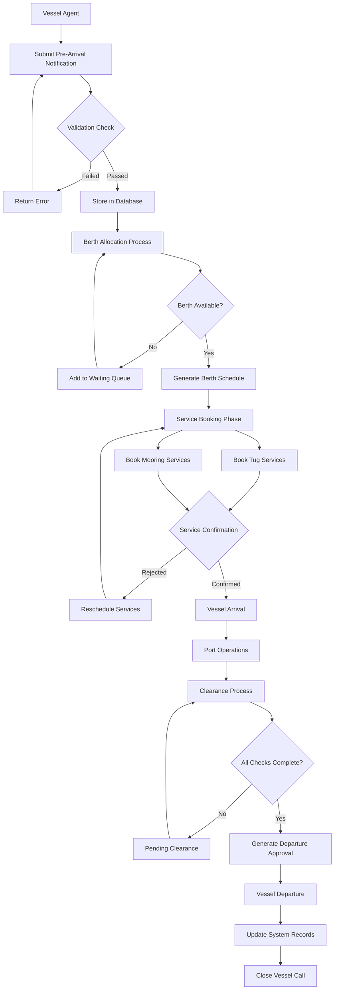
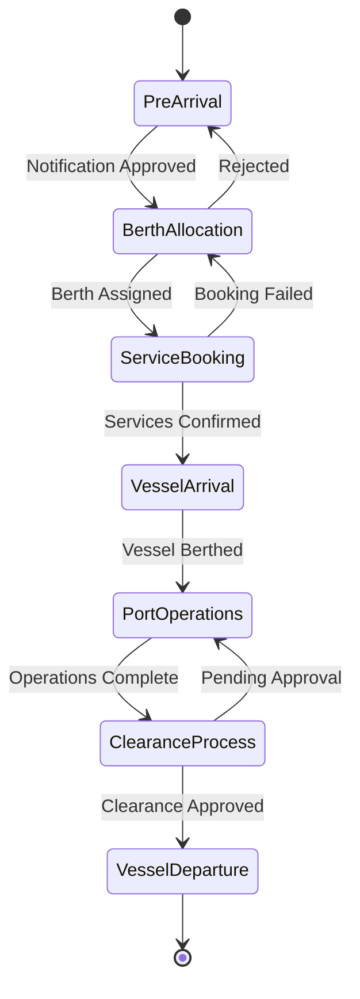
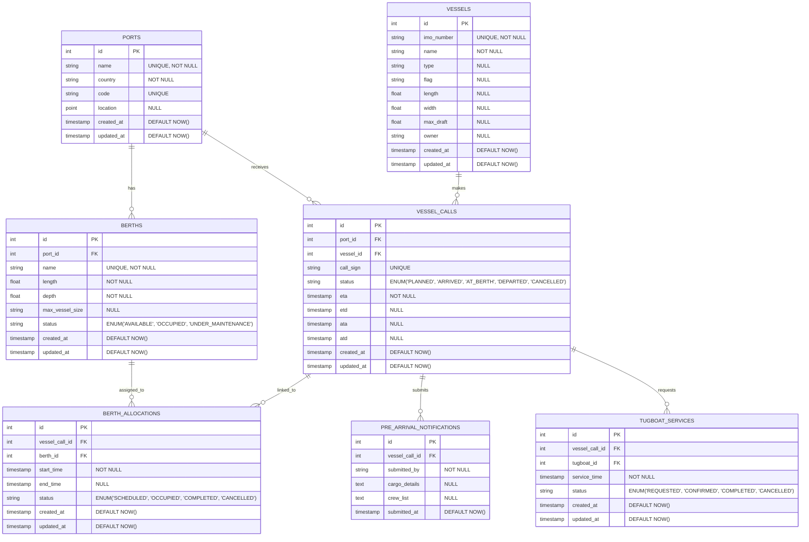
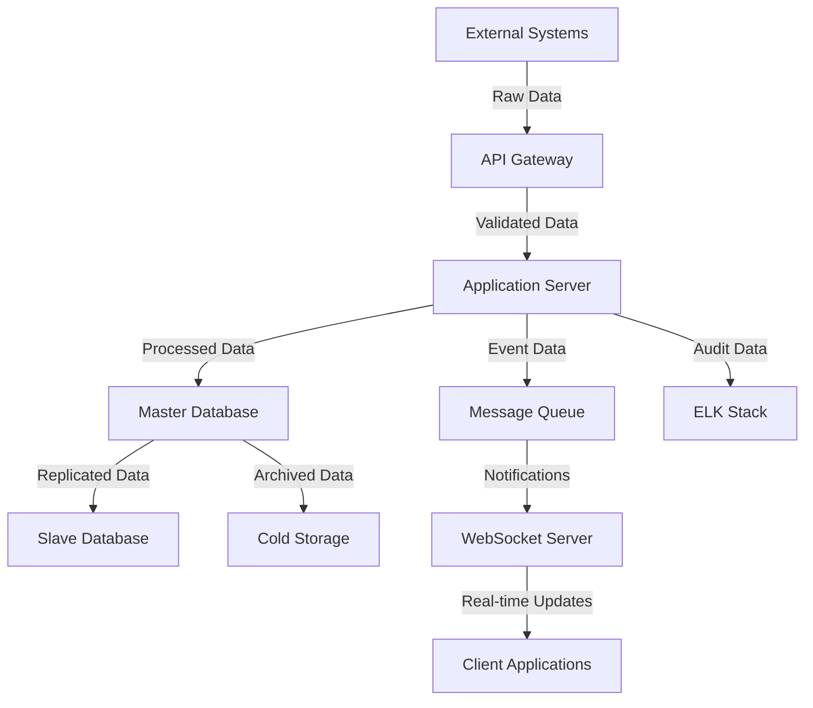

# Product Requirements Document (PRD)

# 1. INTRODUCTION

## 1.1 Purpose

This Software Requirements Specification (SRS) document provides a comprehensive description of the Vessel Call Management module within the Port Community System (PCS). It defines the functional and non-functional requirements for stakeholders including:

- Development team members
- Project managers
- Quality assurance teams
- Port authority representatives
- System architects
- External integration partners

## 1.2 Scope

The Vessel Call Management module is a critical component of the PCS that streamlines and digitizes vessel arrival, berthing, and departure processes. The system encompasses:

### 1.2.1 Core Functionalities

- Electronic pre-arrival notification processing
- Automated berth allocation and scheduling
- Digital coordination of mooring and tug services
- Streamlined port clearance and departure approval workflows

### 1.2.2 Key Benefits

- Reduced vessel waiting times through real-time berth management
- Improved resource utilization for port services
- Enhanced compliance with maritime regulations
- Increased transparency for all stakeholders
- Optimized port operations through data-driven decision making

### 1.2.3 System Boundaries

The module will:

- Interface with existing port authority systems
- Integrate with customs and immigration databases
- Connect with service provider scheduling systems
- Support multi-port operations under single authority
- Manage user access through role-based authentication

The module will not:

- Handle cargo management operations
- Process financial transactions
- Manage port inventory systems
- Control physical port infrastructure

# 2. PRODUCT DESCRIPTION

## 2.1 Product Perspective

The Vessel Call Management module operates as an integral component within the larger Port Community System (PCS), interfacing with multiple external systems and stakeholders. The system follows a monolithic architecture pattern with the following context:

- Integrates with existing port authority systems for vessel tracking and monitoring
- Connects to customs and immigration databases for clearance verification
- Interfaces with service provider systems for tugboat and mooring coordination
- Links to maritime authority databases for vessel and crew validation
- Exchanges data with shipping line systems for pre-arrival notifications

## 2.2 Product Functions

The primary functions of the Vessel Call Management module include:

1. Pre-Arrival Management

   - Electronic submission and validation of vessel pre-arrival notifications
   - Automated verification of vessel documentation and certificates
   - Digital crew list processing and validation

2. Berth Management

   - Intelligent berth allocation based on vessel characteristics
   - Real-time berth availability monitoring
   - Conflict detection and resolution in berthing schedules

3. Service Coordination

   - Digital booking system for tugboat and mooring services
   - Real-time service provider availability tracking
   - Automated service confirmation and notification system

4. Clearance Processing

   - Digital workflow management for port clearance
   - Automated compliance verification with maritime regulations
   - Electronic generation of departure approvals

## 2.3 User Characteristics

| User Type | Characteristics | Technical Expertise |
| --- | --- | --- |
| Port Authority Officers | - Responsible for berth allocation and clearance approvals<br>- Require comprehensive system access<br>- Make critical operational decisions | Moderate |
| Vessel Agents | - Submit pre-arrival notifications<br>- Book port services<br>- Track vessel status | Basic to Moderate |
| Service Providers | - Manage service availability<br>- Receive and confirm booking requests<br>- Update service status | Basic |
| System Administrators | - Configure system parameters<br>- Manage user access<br>- Monitor system performance | Advanced |

## 2.4 Constraints

1. Technical Constraints

   - Must utilize Java (Spring Boot) for backend development
   - Frontend development restricted to Angular framework
   - Required compatibility with existing port authority systems
   - Real-time data synchronization requirements

2. Regulatory Constraints

   - Compliance with international maritime regulations
   - Adherence to local port authority guidelines
   - Data privacy and security requirements
   - Maritime documentation standards

3. Operational Constraints

   - 24/7 system availability requirement
   - Maximum system response time of 3 seconds
   - Support for multiple concurrent users
   - Data retention policies

## 2.5 Assumptions and Dependencies

### Assumptions

1. Stable network connectivity at port facilities
2. Availability of accurate vessel and berth data
3. User access to modern web browsers
4. Basic technical literacy of all users
5. Consistent format of incoming vessel data

### Dependencies

1. External Systems

   - Port authority vessel tracking systems
   - Customs and immigration databases
   - Maritime authority systems
   - Weather information services

2. Infrastructure

   - Reliable hosting infrastructure
   - Adequate network bandwidth
   - Database backup systems
   - Security infrastructure

3. Stakeholder Participation

   - Timely data input from vessel agents
   - Service provider system integration
   - Port authority approval workflows
   - Regular system maintenance windows

# 3. PROCESS FLOWCHART



```mermaid
flowchart LR
    subgraph Pre-Arrival
        A1[Submit Notification] --> A2[Document Validation]
        A2 --> A3[ETA Confirmation]
    end
    
    subgraph Berth Management
        B1[Check Availability] --> B2[Allocate Berth]
        B2 --> B3[Schedule Generation]
    end
    
    subgraph Service Coordination
        C1[Book Services] --> C2[Provider Confirmation]
        C2 --> C3[Resource Allocation]
    end
    
    subgraph Clearance
        D1[Document Check] --> D2[Authority Approval]
        D2 --> D3[Departure Permit]
    end
    
    Pre-Arrival --> Berth Management
    Berth Management --> Service Coordination
    Service Coordination --> Clearance
```



# 4. FUNCTIONAL REQUIREMENTS

## 4.1 Pre-Arrival Notification Management

### ID: F-PAN-001

### Description

Electronic submission and processing of vessel pre-arrival notifications with automated validation

### Priority: High

### Requirements

| ID | Requirement | Priority |
| --- | --- | --- |
| F-PAN-001.1 | System shall provide REST API endpoints for electronic pre-arrival notification submission | High |
| F-PAN-001.2 | System shall validate vessel details against IMO database | High |
| F-PAN-001.3 | System shall verify crew documentation against immigration database | High |
| F-PAN-001.4 | System shall automatically check for hazardous cargo compliance | High |
| F-PAN-001.5 | System shall store validated notifications in PostgreSQL database | Medium |
| F-PAN-001.6 | System shall generate unique vessel call reference number | Medium |

## 4.2 Berth Allocation System

### ID: F-BAS-002

### Description

Intelligent berth allocation and scheduling system with conflict resolution

### Priority: High

### Requirements

| ID | Requirement | Priority |
| --- | --- | --- |
| F-BAS-002.1 | System shall automatically assign berths based on vessel characteristics | High |
| F-BAS-002.2 | System shall detect and resolve berthing schedule conflicts | High |
| F-BAS-002.3 | System shall maintain real-time berth availability status | High |
| F-BAS-002.4 | System shall provide berth schedule visualization in Angular frontend | Medium |
| F-BAS-002.5 | System shall allow manual override by port authority users | Medium |
| F-BAS-002.6 | System shall track historical berth utilization | Low |

## 4.3 Service Coordination

### ID: F-SVC-003

### Description

Digital booking and coordination system for port services including tugs and mooring

### Priority: Medium

### Requirements

| ID | Requirement | Priority |
| --- | --- | --- |
| F-SVC-003.1 | System shall enable digital booking of tug services | High |
| F-SVC-003.2 | System shall enable digital booking of mooring services | High |
| F-SVC-003.3 | System shall track real-time service provider availability | Medium |
| F-SVC-003.4 | System shall send WebSocket notifications for booking confirmations | Medium |
| F-SVC-003.5 | System shall allow modification of existing bookings | Medium |
| F-SVC-003.6 | System shall maintain service provider schedules | Low |

## 4.4 Port Clearance Management

### ID: F-PCM-004

### Description

Digital workflow system for managing port clearance and departure approvals

### Priority: High

### Requirements

| ID | Requirement | Priority |
| --- | --- | --- |
| F-PCM-004.1 | System shall automate clearance workflow processes | High |
| F-PCM-004.2 | System shall integrate with customs systems via API | High |
| F-PCM-004.3 | System shall verify payment status for port dues | High |
| F-PCM-004.4 | System shall generate digital departure certificates | Medium |
| F-PCM-004.5 | System shall maintain audit logs of clearance process | Medium |
| F-PCM-004.6 | System shall provide real-time clearance status updates | Medium |

## 4.5 Multi-Port Operations

### ID: F-MPO-005

### Description

Support for managing vessel calls across multiple ports under single authority

### Priority: Medium

### Requirements

| ID | Requirement | Priority |
| --- | --- | --- |
| F-MPO-005.1 | System shall support configuration of multiple ports | High |
| F-MPO-005.2 | System shall maintain separate berth schedules per port | High |
| F-MPO-005.3 | System shall enable cross-port vessel movement tracking | Medium |
| F-MPO-005.4 | System shall provide consolidated multi-port reporting | Medium |
| F-MPO-005.5 | System shall support port-specific business rules | Medium |
| F-MPO-005.6 | System shall enable data sharing between ports | Low |

# 5. NON-FUNCTIONAL REQUIREMENTS

## 5.1 Performance Requirements

| Requirement ID | Description | Target Metric |
| --- | --- | --- |
| NFR-PER-001 | API response time for standard operations | \< 3 seconds |
| NFR-PER-002 | Database query execution time | \< 1 second |
| NFR-PER-003 | Maximum concurrent users supported | 1000 users |
| NFR-PER-004 | Real-time data synchronization delay | \< 5 seconds |
| NFR-PER-005 | Maximum file upload size for documents | 10MB |
| NFR-PER-006 | WebSocket message delivery time | \< 1 second |
| NFR-PER-007 | System resource utilization | \< 80% CPU, \< 85% memory |

## 5.2 Safety Requirements

| Requirement ID | Description | Priority |
| --- | --- | --- |
| NFR-SAF-001 | Automated daily database backups with 30-day retention | High |
| NFR-SAF-002 | Failover system activation time | \< 5 minutes |
| NFR-SAF-003 | Data consistency verification after system recovery | Critical |
| NFR-SAF-004 | Automatic session termination after 30 minutes of inactivity | High |
| NFR-SAF-005 | Transaction rollback mechanisms for failed operations | Critical |

## 5.3 Security Requirements

| Requirement ID | Description | Implementation |
| --- | --- | --- |
| NFR-SEC-001 | OAuth2 authentication with JWT tokens | Spring Security |
| NFR-SEC-002 | Role-based access control (RBAC) | Custom RBAC module |
| NFR-SEC-003 | Data encryption at rest | AES-256 encryption |
| NFR-SEC-004 | SSL/TLS encryption for all communications | TLS 1.3 |
| NFR-SEC-005 | Password policy enforcement | Min 12 chars, complexity rules |
| NFR-SEC-006 | Audit logging of all system actions | ELK Stack |
| NFR-SEC-007 | Two-factor authentication for admin access | Google Authenticator |

## 5.4 Quality Requirements

### 5.4.1 Availability

- System uptime: 99.9% (excluding planned maintenance)
- Planned maintenance window: Sundays 02:00-04:00 UTC
- Maximum unplanned downtime: 4 hours per month

### 5.4.2 Maintainability

- Modular architecture with clear separation of concerns
- Comprehensive API documentation using Swagger/OpenAPI
- Code coverage minimum: 80%
- Automated deployment scripts and configuration management

### 5.4.3 Usability

- Responsive design supporting all modern browsers
- Maximum page load time: 3 seconds
- Intuitive navigation requiring no more than 3 clicks
- Multi-language support (English, Spanish, Mandarin)

### 5.4.4 Scalability

- Horizontal scaling capability up to 5 application nodes
- Database partitioning for data exceeding 1TB
- Load balancer support for traffic distribution
- Caching implementation using Redis

### 5.4.5 Reliability

- Mean Time Between Failures (MTBF): \> 720 hours
- Mean Time To Repair (MTTR): \< 2 hours
- Error rate: \< 0.1% of all transactions
- Automated system health monitoring and alerts

## 5.5 Compliance Requirements

| Requirement ID | Description | Standard/Regulation |
| --- | --- | --- |
| NFR-COM-001 | GDPR compliance for personal data handling | EU GDPR |
| NFR-COM-002 | Maritime safety information standards | SOLAS Convention |
| NFR-COM-003 | Port security regulations compliance | ISPS Code |
| NFR-COM-004 | Electronic data interchange standards | UN/EDIFACT |
| NFR-COM-005 | Accessibility compliance | WCAG 2.1 Level AA |
| NFR-COM-006 | Environmental reporting standards | IMO regulations |
| NFR-COM-007 | Data retention policies | Local port authority rules |

# 6. DATA REQUIREMENTS

## 6.1 Data Models

Here is the core data model. You can elaborate and add more entities as you see fit.



## 6.2 Data Storage

### 6.2.1 Primary Storage

- PostgreSQL database cluster with master-slave replication
- Partitioning strategy:
  - Vessel calls partitioned by date
  - Historical data partitioned by year
  - Active data maintained in current partition

### 6.2.2 Data Retention

| Data Type | Retention Period | Storage Type |
| --- | --- | --- |
| Vessel Calls | 7 years | PostgreSQL + Archive |
| Pre-arrival Notifications | 5 years | PostgreSQL + Archive |
| Berth Allocations | 3 years | PostgreSQL |
| Service Bookings | 3 years | PostgreSQL |
| Audit Logs | 5 years | ELK Stack |
| System Logs | 90 days | ELK Stack |

### 6.2.3 Backup Strategy

- Daily full database backups
- Continuous WAL (Write-Ahead Log) archiving
- Cross-region backup replication
- 30-day backup retention with monthly archives
- Automated backup verification and restoration testing

### 6.2.4 Recovery Procedures

- Point-in-time recovery capability
- Maximum RPO (Recovery Point Objective): 5 minutes
- Maximum RTO (Recovery Time Objective): 1 hour
- Automated failover to standby database
- Regular disaster recovery drills

## 6.3 Data Processing

### 6.3.1 Data Flow



### 6.3.2 Data Security

| Layer | Security Measure | Implementation |
| --- | --- | --- |
| Transport | TLS 1.3 encryption | Spring Security |
| Application | Input validation | Custom validators |
| Database | Column-level encryption | AES-256 |
| Backup | Encrypted backups | pgcrypto |
| API | Request signing | JWT/OAuth2 |

### 6.3.3 Data Transformation Rules

- Vessel positions: Convert to standard coordinate system
- Dates: Store in UTC, display in local timezone
- Measurements: Convert to metric system
- Currency: Store in USD, convert for display
- Documents: Store as PDF/A format
- Images: Compress and store in WebP format

### 6.3.4 Data Validation Rules

- IMO numbers: 7-digit format with check digit
- Vessel dimensions: Within port limits
- Dates: Not in past for future events
- Coordinates: Within port geographical bounds
- Document sizes: Maximum 10MB per file
- Required fields: Based on vessel type and cargo

# 7. EXTERNAL INTERFACES

## 7.1 User Interfaces

### 7.1.1 General Requirements

- Responsive web interface supporting minimum resolution of 1366x768
- Support for Chrome (v90+), Firefox (v85+), Safari (v14+), Edge (v90+)
- Dark/light theme support with high contrast options
- Maximum page load time of 3 seconds
- WCAG 2.1 Level AA compliance

### 7.1.2 Key Interface Components

| Interface Component | Description | Primary Users |
| --- | --- | --- |
| Vessel Dashboard | Real-time view of vessel calls, berth status, and operations | Port Authority, Vessel Agents |
| Berth Planning Board | Interactive Gantt chart for berth scheduling and allocation | Port Planners |
| Service Booking Portal | Form-based interface for requesting port services | Vessel Agents |
| Clearance Workflow | Step-by-step interface for managing vessel clearances | Customs, Immigration |
| Administration Console | System configuration and user management interface | System Administrators |

### 7.1.3 Interface Mockup Placeholders

```
[Placeholder: Vessel Dashboard Layout]
- Main navigation
- Vessel call summary cards
- Status indicators
- Action buttons
- Filter panel
```

```
[Placeholder: Berth Planning Board]
- Timeline view
- Berth rows
- Vessel allocation blocks
- Drag-drop interface
- Conflict indicators
```

## 7.2 Hardware Interfaces

### 7.2.1 Port Infrastructure Systems

| System | Interface Type | Protocol |
| --- | --- | --- |
| VTS Radar Systems | TCP/IP | NMEA 0183 |
| Berth Sensors | REST API | HTTPS |
| Digital Display Boards | Serial/TCP | Modbus TCP |
| CCTV Systems | RTSP | H.264/ONVIF |

### 7.2.2 Hardware Requirements

- Minimum server specifications:
  - CPU: 8 cores @ 2.5GHz
  - RAM: 32GB
  - Storage: 2TB SSD (RAID 10)
  - Network: Dual 10Gbps NICs

## 7.3 Software Interfaces

### 7.3.1 External System Integration

| System | Interface Type | Data Exchange Format |
| --- | --- | --- |
| Customs Management System | REST API | JSON/XML |
| Immigration Database | SOAP Web Service | XML |
| Weather Information Service | REST API | JSON |
| Maritime Authority Database | REST API | JSON |
| Shipping Line Systems | REST API/SFTP | EDIFACT/JSON |

### 7.3.2 Internal System Integration

| Component | Interface Method | Protocol |
| --- | --- | --- |
| PostgreSQL Database | JDBC | TCP/IP |
| Redis Cache | Lettuce Client | TCP/IP |
| ELK Stack | REST API | HTTPS |
| Message Queue | AMQP | TCP/IP |

## 7.4 Communication Interfaces

### 7.4.1 Network Protocols

| Protocol | Usage | Port |
| --- | --- | --- |
| HTTPS | Secure web traffic | 443 |
| WSS | WebSocket secure | 443 |
| AMQP | Message queuing | 5672 |
| SMTP | Email notifications | 587 |

### 7.4.2 Data Exchange Formats

| Format | Usage | Validation |
| --- | --- | --- |
| JSON | REST API responses | JSON Schema |
| XML | SOAP messages | XSD |
| EDIFACT | Shipping messages | UN/EDIFACT D.21B |
| CSV | Report exports | RFC 4180 |

### 7.4.3 API Specifications

```yaml
openapi: 3.0.0
info:
  title: Vessel Call Management API
  version: 1.0.0
paths:
  /api/v1/vessels:
    get:
      summary: List vessels
  /api/v1/berths:
    get:
      summary: Get berth status
  /api/v1/services:
    post:
      summary: Book port services
```

### 7.4.4 Notification Channels

| Channel | Protocol | Format |
| --- | --- | --- |
| Real-time Updates | WebSocket | JSON |
| Email Alerts | SMTP/TLS | MIME |
| SMS Notifications | HTTP | REST |
| System Events | AMQP | JSON |

# 8. APPENDICES

## 8.1 GLOSSARY

| Term | Definition |
| --- | --- |
| Berth | A designated location where a vessel can dock at a port |
| Call Reference | Unique identifier assigned to each vessel visit to the port |
| ETA | Estimated Time of Arrival of a vessel at the port |
| ETD | Estimated Time of Departure of a vessel from the port |
| Hazmat | Hazardous Materials carried as cargo |
| Port Dues | Fees charged by port authorities for using port facilities |
| Pre-Arrival Notification | Advance notice provided by vessels before arrival |
| VTS | Vessel Traffic Service system for monitoring port traffic |
| WAL | Write-Ahead Logging used in database systems |

## 8.2 ACRONYMS

| Acronym | Expansion |
| --- | --- |
| AMQP | Advanced Message Queuing Protocol |
| API | Application Programming Interface |
| ELK | Elasticsearch, Logstash, and Kibana |
| GDPR | General Data Protection Regulation |
| IMO | International Maritime Organization |
| ISPS | International Ship and Port Facility Security |
| JWT | JSON Web Token |
| MTBF | Mean Time Between Failures |
| MTTR | Mean Time To Repair |
| NIC | Network Interface Card |
| PCS | Port Community System |
| RBAC | Role-Based Access Control |
| REST | Representational State Transfer |
| RoRo | Roll-on/Roll-off |
| RPO | Recovery Point Objective |
| RTO | Recovery Time Objective |
| SOAP | Simple Object Access Protocol |
| SOLAS | Safety of Life at Sea |
| SSL/TLS | Secure Sockets Layer/Transport Layer Security |
| WCAG | Web Content Accessibility Guidelines |

## 8.3 ADDITIONAL REFERENCES

| Reference | Description | URL |
| --- | --- | --- |
| Spring Boot Documentation | Official documentation for Spring Boot framework | https://docs.spring.io/spring-boot/docs/current/reference/html/ |
| Angular Documentation | Official Angular framework documentation | https://angular.io/docs |
| PostgreSQL Documentation | PostgreSQL database documentation | https://www.postgresql.org/docs/ |
| UN/EDIFACT Standards | Electronic Data Interchange standards | https://unece.org/trade/uncefact/introducing-unedifact |
| ISPS Code | International Ship and Port Facility Security Code | https://www.imo.org/en/OurWork/Security/Pages/SOLAS-XI-2%20ISPS%20Code.aspx |
| OAuth 2.0 Specification | Authorization framework specification | https://oauth.net/2/ |
| WCAG Guidelines | Web accessibility guidelines | https://www.w3.org/WAI/standards-guidelines/wcag/ |
| Maritime Safety Information | IMO safety regulations and guidelines | https://www.imo.org/en/OurWork/Safety/ |