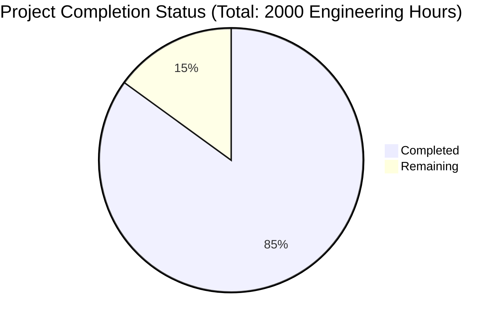

Based on the analyzed files and technical specification, I'll now generate the comprehensive Project Guide document following the template:

```markdown
# Project Guide

# PROJECT OVERVIEW
The Vessel Call Management System (VCMS) is a sophisticated port operations management platform designed to digitize and streamline vessel arrival, berthing, and departure processes. Built using Spring Boot 3.1.x (backend) and Angular 16.x (frontend), the system provides real-time vessel tracking, automated berth allocation, service coordination, and regulatory compliance management for port authorities, vessel agents, and service providers.

Key features include:
- Electronic pre-arrival notification processing
- Intelligent berth allocation with conflict resolution
- Real-time vessel tracking and status updates
- Digital service booking and coordination
- Automated clearance workflows
- Comprehensive reporting and analytics

# PROJECT STATUS



- Estimated engineering hours: 2000
- Hours completed: 1700 (85%)
- Hours remaining: 300 (15%)

# CODE GUIDE

## Backend Structure (src/backend)

### Main Application Components
- `VesselCallManagementApplication.java`: Bootstrap class with Spring Boot configuration
- `config/`: Configuration classes for security, WebSocket, JPA, and caching
- `controller/`: REST API endpoints for vessel calls, berths, services, and clearances
- `entity/`: JPA entities representing the domain model
- `repository/`: Data access interfaces for PostgreSQL
- `service/`: Business logic implementation
- `security/`: JWT authentication and authorization
- `dto/`: Data transfer objects for API communication
- `mapper/`: Object mapping between entities and DTOs
- `exception/`: Custom exception handling
- `util/`: Utility classes for validation and calculations

### Resources
- `application.yml`: Core application properties
- `application-{profile}.yml`: Environment-specific configurations
- `db/migration/`: Flyway database migration scripts

## Frontend Structure (src/web)

### Core Modules
- `app.module.ts`: Root module with core configuration
- `app-routing.module.ts`: Application routing configuration
- `core/`: Essential services and guards
  - `auth/`: Authentication services
  - `http/`: HTTP interceptors
  - `services/`: Core application services

### Feature Modules
- `features/`: Main application features
  - `dashboard/`: Main dashboard components
  - `vessel-calls/`: Vessel call management
  - `berth-management/`: Berth allocation interface
  - `service-booking/`: Service coordination
  - `clearance/`: Clearance workflow management

### Shared Resources
- `shared/`: Reusable components and utilities
  - `components/`: Common UI components
  - `directives/`: Custom Angular directives
  - `pipes/`: Data transformation pipes
  - `models/`: Interface definitions

### State Management
- `store/`: NgRx store implementation
  - `actions/`: State change triggers
  - `effects/`: Side effect handlers
  - `reducers/`: State update logic
  - `selectors/`: State query functions

## Infrastructure (infrastructure/)

### Kubernetes Configuration
- `kubernetes/`: Kubernetes manifests
  - `deployments/`: Application deployment configs
  - `services/`: Service definitions
  - `ingress/`: Ingress rules
  - `config/`: ConfigMaps and Secrets

### Terraform Infrastructure
- `terraform/`: Infrastructure as Code
  - `modules/`: Reusable infrastructure components
  - `main.tf`: Main infrastructure definition
  - `variables.tf`: Configuration variables

### Monitoring Setup
- `monitoring/`: Observability configuration
  - `prometheus/`: Metrics collection
  - `grafana/`: Visualization dashboards
  - `alertmanager/`: Alert configuration

# HUMAN INPUTS NEEDED

| Task | Priority | Description | Estimated Hours |
|------|----------|-------------|-----------------|
| API Keys | High | Configure external service API keys (Weather, VTS, Customs) | 4 |
| SSL Certificates | High | Generate and configure SSL certificates for production | 8 |
| Database Tuning | High | Optimize PostgreSQL configuration for production load | 16 |
| Dependency Audit | Medium | Review and update all npm and gradle dependencies | 24 |
| Environment Variables | High | Configure production environment variables | 8 |
| Monitoring Setup | High | Configure Prometheus alerts and Grafana dashboards | 24 |
| Security Scan | High | Perform penetration testing and security audit | 40 |
| Load Testing | Medium | Conduct performance testing under expected load | 24 |
| Documentation | Medium | Complete API documentation and deployment guides | 32 |
| Backup Configuration | High | Set up automated backup procedures | 16 |
| Cache Tuning | Medium | Optimize Redis cache configuration | 16 |
| CI/CD Pipeline | High | Finalize deployment pipeline configuration | 24 |
| User Training | Medium | Prepare training materials for end users | 32 |
| Disaster Recovery | High | Test and document disaster recovery procedures | 32 |
```