# Technical Specifications

# 1. INTRODUCTION

## 1.1 Executive Summary

The Vessel Call Management module is a critical component of the Port Community System (PCS) designed to digitize and streamline vessel arrival, berthing, and departure processes. This system addresses the complex challenges of coordinating multiple stakeholders, optimizing port resource utilization, and ensuring regulatory compliance in maritime operations. The solution will serve port authorities, vessel agents, service providers, and regulatory bodies by providing real-time visibility, automated workflows, and intelligent resource allocation.

The implementation will significantly reduce vessel waiting times, improve berth utilization, enhance service coordination, and ensure transparent communication among all stakeholders while maintaining strict compliance with maritime regulations.

## 1.2 System Overview

### Project Context

| Aspect | Description |
| --- | --- |
| Business Context | Modernization of port operations through digital transformation |
| Current Limitations | Manual processes, paper-based workflows, delayed communications |
| Enterprise Integration | Integration with existing port authority systems, customs databases, and maritime authority platforms |

### High-Level Description

| Component | Details |
| --- | --- |
| Primary Capabilities | - Electronic pre-arrival notification processing<br>- Automated berth allocation<br>- Digital service coordination<br>- Streamlined clearance workflows |
| Architecture | Monolithic application using Spring Boot (Backend) and Angular (Frontend) |
| Core Components | - REST API layer<br>- PostgreSQL database<br>- WebSocket notifications<br>- OAuth2/JWT security |
| Technical Approach | Cloud-native deployment with containerization support |

### Success Criteria

| Category | Metrics |
| --- | --- |
| Operational | - 50% reduction in vessel waiting time<br>- 30% improvement in berth utilization<br>- 90% reduction in paper-based processes |
| Technical | - 99.9% system uptime<br>- \<3 second response time<br>- Zero data loss |
| Business | - 40% reduction in port call coordination costs<br>- 25% increase in service booking efficiency |

## 1.3 Scope

### In-Scope Elements

#### Core Features and Functionalities

| Feature Category | Included Components |
| --- | --- |
| Pre-Arrival Management | - Electronic notification submission<br>- Document validation<br>- Cargo manifest processing |
| Berth Management | - Automated allocation algorithms<br>- Conflict resolution<br>- Schedule optimization |
| Service Coordination | - Digital booking system<br>- Resource availability tracking<br>- Service confirmation workflow |
| Clearance Processing | - Digital clearance workflows<br>- Regulatory compliance checks<br>- Departure approval automation |

#### Implementation Boundaries

| Boundary Type | Coverage |
| --- | --- |
| User Groups | - Port authority personnel<br>- Vessel agents<br>- Service providers<br>- Regulatory bodies |
| Geographic Scope | Multiple ports under single port authority |
| Data Domains | - Vessel information<br>- Berth data<br>- Service schedules<br>- Clearance records |

### Out-of-Scope Elements

| Category | Excluded Elements |
| --- | --- |
| Features | - Cargo handling operations<br>- Financial transaction processing<br>- Port inventory management |
| Integrations | - Terminal operating systems<br>- Port equipment control systems<br>- Financial management systems |
| Operations | - Physical security management<br>- Environmental monitoring<br>- Maintenance scheduling |
| Future Considerations | - Multi-authority operations<br>- Mobile application development<br>- Machine learning optimizations |

# 2. SYSTEM ARCHITECTURE

## 2.1 High-Level Architecture

The Vessel Call Management system follows a monolithic architecture pattern with clear component boundaries and modular design.

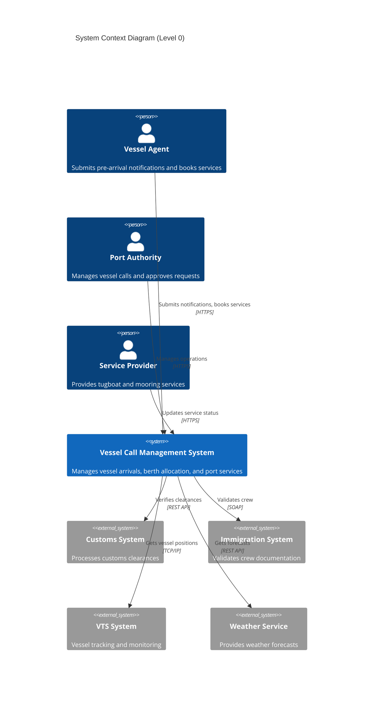
```mermaid
C4Context
    title System Context Diagram (Level 0)
    
    Person(vesselAgent, "Vessel Agent", "Submits pre-arrival notifications and books services")
    Person(portAuthority, "Port Authority", "Manages vessel calls and approves requests")
    Person(serviceProvider, "Service Provider", "Provides tugboat and mooring services")
    
    System(vcm, "Vessel Call Management System", "Manages vessel arrivals, berth allocation, and port services")
    
    System_Ext(customs, "Customs System", "Processes customs clearances")
    System_Ext(immigration, "Immigration System", "Validates crew documentation")
    System_Ext(vts, "VTS System", "Vessel tracking and monitoring")
    System_Ext(weather, "Weather Service", "Provides weather forecasts")
    
    Rel(vesselAgent, vcm, "Submits notifications, books services", "HTTPS")
    Rel(portAuthority, vcm, "Manages operations", "HTTPS")
    Rel(serviceProvider, vcm, "Updates service status", "HTTPS")
    
    Rel(vcm, customs, "Verifies clearances", "REST API")
    Rel(vcm, immigration, "Validates crew", "SOAP")
    Rel(vcm, vts, "Gets vessel positions", "TCP/IP")
    Rel(vcm, weather, "Gets forecasts", "REST API")
```

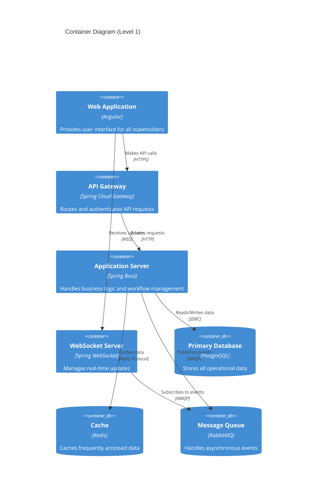
```mermaid
C4Container
    title Container Diagram (Level 1)
    
    Container(webApp, "Web Application", "Angular", "Provides user interface for all stakeholders")
    Container(apiGateway, "API Gateway", "Spring Cloud Gateway", "Routes and authenticates API requests")
    Container(appServer, "Application Server", "Spring Boot", "Handles business logic and workflow management")
    Container(wsServer, "WebSocket Server", "Spring WebSocket", "Manages real-time updates")
    
    ContainerDb(db, "Primary Database", "PostgreSQL", "Stores all operational data")
    ContainerDb(cache, "Cache", "Redis", "Caches frequently accessed data")
    ContainerDb(queue, "Message Queue", "RabbitMQ", "Handles asynchronous events")
    
    Rel(webApp, apiGateway, "Makes API calls", "HTTPS")
    Rel(webApp, wsServer, "Receives updates", "WSS")
    Rel(apiGateway, appServer, "Routes requests", "HTTP")
    Rel(appServer, db, "Reads/Writes data", "JDBC")
    Rel(appServer, cache, "Caches data", "Redis Protocol")
    Rel(appServer, queue, "Publishes events", "AMQP")
    Rel(wsServer, queue, "Subscribes to events", "AMQP")
```

## 2.2 Component Details

### 2.2.1 Core Components

| Component | Purpose | Technologies | Scaling Strategy |
| --- | --- | --- | --- |
| Web Frontend | User interface and interaction | Angular, TypeScript, RxJS | Horizontal scaling with CDN |
| API Gateway | Request routing and security | Spring Cloud Gateway | Horizontal scaling with load balancer |
| Application Server | Business logic processing | Spring Boot, Java 17 | Horizontal scaling with session replication |
| WebSocket Server | Real-time updates | Spring WebSocket, STOMP | Horizontal scaling with sticky sessions |
| Database | Data persistence | PostgreSQL 14 | Master-slave replication |
| Cache | Performance optimization | Redis 6 | Redis cluster |
| Message Queue | Event handling | RabbitMQ | Clustered deployment |

### 2.2.2 Component Interactions

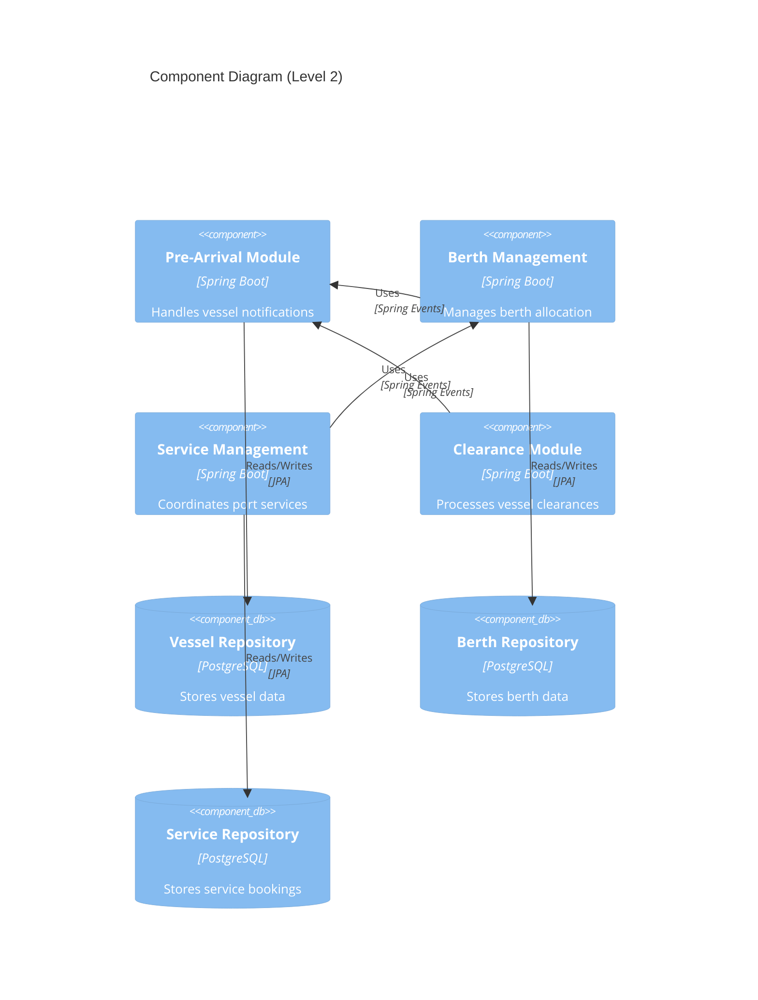
```mermaid
C4Component
    title Component Diagram (Level 2)
    
    Component(preArrival, "Pre-Arrival Module", "Spring Boot", "Handles vessel notifications")
    Component(berthMgmt, "Berth Management", "Spring Boot", "Manages berth allocation")
    Component(serviceMgmt, "Service Management", "Spring Boot", "Coordinates port services")
    Component(clearance, "Clearance Module", "Spring Boot", "Processes vessel clearances")
    
    ComponentDb(vesselDb, "Vessel Repository", "PostgreSQL", "Stores vessel data")
    ComponentDb(berthDb, "Berth Repository", "PostgreSQL", "Stores berth data")
    ComponentDb(serviceDb, "Service Repository", "PostgreSQL", "Stores service bookings")
    
    Rel(preArrival, vesselDb, "Reads/Writes", "JPA")
    Rel(berthMgmt, berthDb, "Reads/Writes", "JPA")
    Rel(serviceMgmt, serviceDb, "Reads/Writes", "JPA")
    Rel(berthMgmt, preArrival, "Uses", "Spring Events")
    Rel(serviceMgmt, berthMgmt, "Uses", "Spring Events")
    Rel(clearance, preArrival, "Uses", "Spring Events")
```

## 2.3 Technical Decisions

### 2.3.1 Architecture Decisions

| Decision | Rationale | Trade-offs |
| --- | --- | --- |
| Monolithic Architecture | Simpler deployment, development, and testing | Limited independent scaling |
| Event-Driven Communication | Loose coupling, better scalability | Increased complexity in event handling |
| PostgreSQL Database | ACID compliance, spatial data support | Higher resource requirements |
| Redis Caching | High performance, distributed caching | Additional infrastructure complexity |
| JWT Authentication | Stateless authentication, scalability | Token size, revocation complexity |

### 2.3.2 Data Flow Patterns

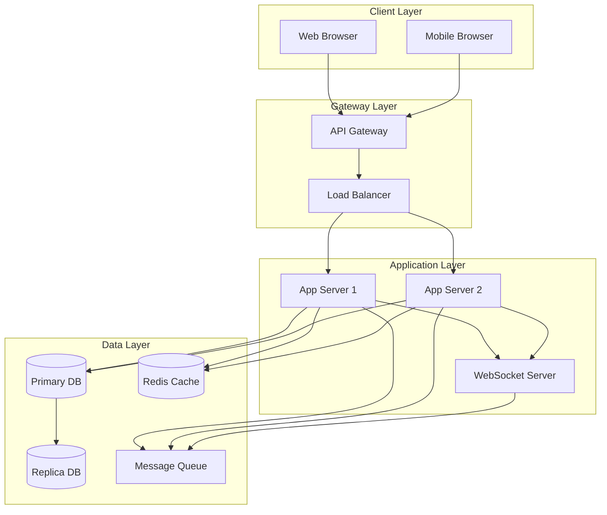
```mermaid
flowchart TD
    subgraph Client Layer
        A[Web Browser]
        B[Mobile Browser]
    end
    
    subgraph Gateway Layer
        C[API Gateway]
        D[Load Balancer]
    end
    
    subgraph Application Layer
        E[App Server 1]
        F[App Server 2]
        G[WebSocket Server]
    end
    
    subgraph Data Layer
        H[(Primary DB)]
        I[(Replica DB)]
        J[(Redis Cache)]
        K[Message Queue]
    end
    
    A & B --> C
    C --> D
    D --> E & F
    E & F --> G
    E & F --> H
    H --> I
    E & F --> J
    E & F --> K
    G --> K
```

## 2.4 Cross-Cutting Concerns

### 2.4.1 System Deployment

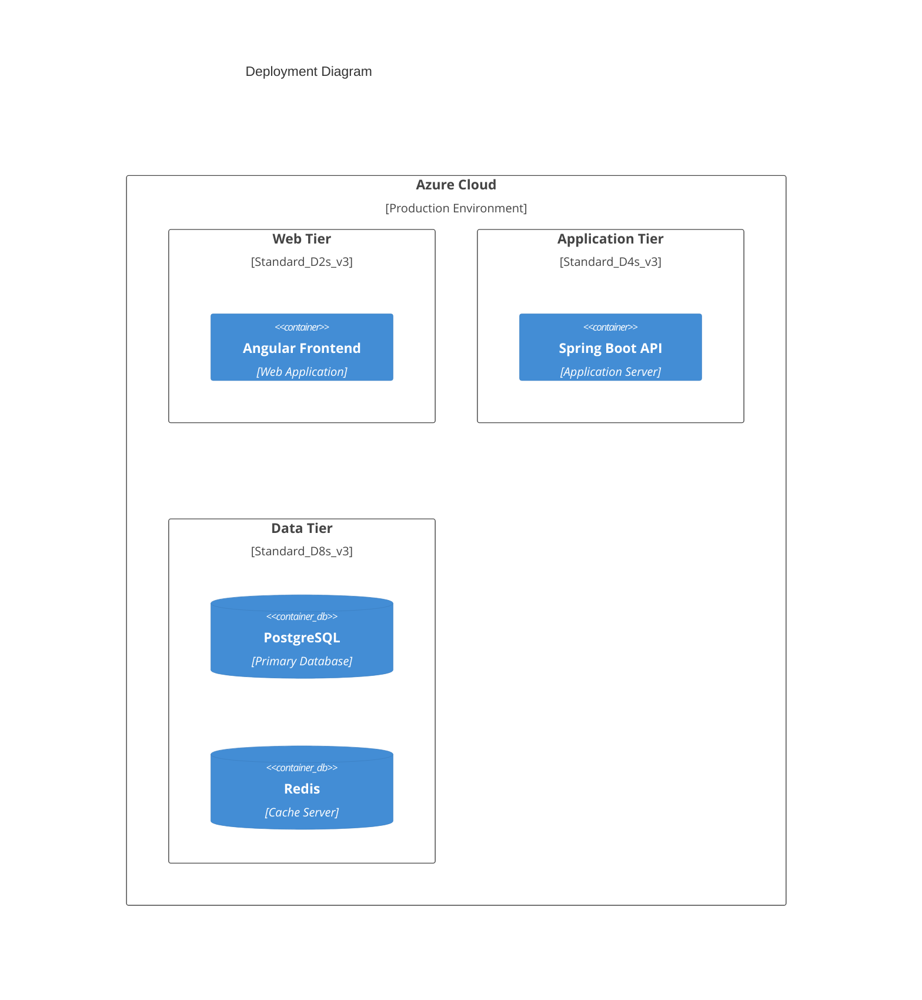
```mermaid
C4Deployment
    title Deployment Diagram
    
    Deployment_Node(az, "Azure Cloud", "Production Environment") {
        Deployment_Node(web, "Web Tier", "Standard_D2s_v3") {
            Container(ui, "Angular Frontend", "Web Application")
        }
        Deployment_Node(app, "Application Tier", "Standard_D4s_v3") {
            Container(api, "Spring Boot API", "Application Server")
        }
        Deployment_Node(data, "Data Tier", "Standard_D8s_v3") {
            ContainerDb(db, "PostgreSQL", "Primary Database")
            ContainerDb(cache, "Redis", "Cache Server")
        }
    }
```

### 2.4.2 Monitoring and Observability

| Component | Tool | Metrics |
| --- | --- | --- |
| Application Metrics | Micrometer | CPU, Memory, Thread pools |
| Log Aggregation | ELK Stack | Application logs, System logs |
| APM | Spring Cloud Sleuth | Distributed tracing |
| Infrastructure | Azure Monitor | Resource utilization |
| Alerts | Azure Alert Rules | SLA breaches, Error rates |

### 2.4.3 Security Architecture

| Layer | Security Control | Implementation |
| --- | --- | --- |
| Network | Web Application Firewall | Azure WAF |
| Transport | TLS 1.3 | Spring Security |
| Application | OAuth2/JWT | Spring Security OAuth |
| Data | Column-level Encryption | Custom AES implementation |
| Audit | Comprehensive Logging | AOP, Spring Events |

# 3. SYSTEM COMPONENTS ARCHITECTURE

## 3.1 User Interface Design

### 3.1.1 Design System Specifications

| Component | Specification | Details |
| --- | --- | --- |
| Typography | Primary Font | Roboto for UI elements |
|  | Secondary Font | Open Sans for content |
|  | Scale | 16px base size with 1.25 ratio |
| Color Palette | Primary | #1976D2 (Blue) |
|  | Secondary | #424242 (Gray) |
|  | Accent | #FF4081 (Pink) |
| Grid System | Layout | 12-column responsive grid |
|  | Breakpoints | xs: 0px, sm: 600px, md: 960px, lg: 1280px, xl: 1920px |
| Spacing | Base Unit | 8px with geometric progression |
| Components | Design Library | Angular Material Components |
|  | Custom Elements | Port-specific UI components |

### 3.1.2 Interface Layout Structure

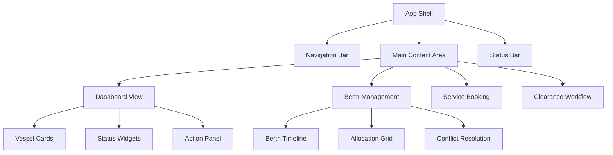
```mermaid
graph TD
    A[App Shell] --> B[Navigation Bar]
    A --> C[Main Content Area]
    A --> D[Status Bar]
    
    C --> E[Dashboard View]
    C --> F[Berth Management]
    C --> G[Service Booking]
    C --> H[Clearance Workflow]
    
    E --> I[Vessel Cards]
    E --> J[Status Widgets]
    E --> K[Action Panel]
    
    F --> L[Berth Timeline]
    F --> M[Allocation Grid]
    F --> N[Conflict Resolution]
```

### 3.1.3 Critical User Flows

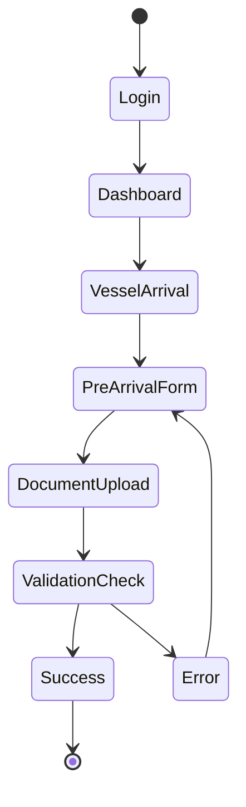
```mermaid
stateDiagram-v2
    [*] --> Login
    Login --> Dashboard
    Dashboard --> VesselArrival
    VesselArrival --> PreArrivalForm
    PreArrivalForm --> DocumentUpload
    DocumentUpload --> ValidationCheck
    ValidationCheck --> Success
    ValidationCheck --> Error
    Error --> PreArrivalForm
    Success --> [*]
```

### 3.1.4 Responsive Design Requirements

| Device Category | Resolution | Layout Adjustments |
| --- | --- | --- |
| Desktop | ≥1280px | Full feature set, multi-column layout |
| Tablet | 768px-1279px | Condensed navigation, simplified grid |
| Mobile | ≤767px | Single column, collapsible panels |
| Large Display | ≥1920px | Enhanced data visualization, multi-window support |

## 3.2 Database Design

### 3.2.1 Schema Design

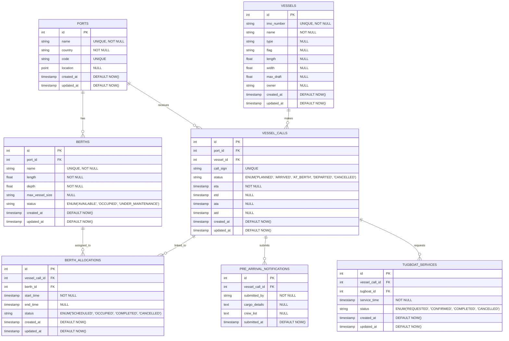
```mermaid
erDiagram

    %% === MASTER DATA ===
    PORTS {
        int id PK
        string name "UNIQUE, NOT NULL"
        string country "NOT NULL"
        string code "UNIQUE"
        point location "NULL"
        timestamp created_at "DEFAULT NOW()"
        timestamp updated_at "DEFAULT NOW()"
    }
    
    BERTHS {
        int id PK
        int port_id FK
        string name "UNIQUE, NOT NULL"
        float length "NOT NULL"
        float depth "NOT NULL"
        string max_vessel_size "NULL"
        string status "ENUM('AVAILABLE', 'OCCUPIED', 'UNDER_MAINTENANCE')"
        timestamp created_at "DEFAULT NOW()"
        timestamp updated_at "DEFAULT NOW()"
    }
    
    VESSELS {
        int id PK
        string imo_number "UNIQUE, NOT NULL"
        string name "NOT NULL"
        string type "NULL"
        string flag "NULL"
        float length "NULL"
        float width "NULL"
        float max_draft "NULL"
        string owner "NULL"
        timestamp created_at "DEFAULT NOW()"
        timestamp updated_at "DEFAULT NOW()"
    }

    %% === VESSEL CALL MANAGEMENT ===
    VESSEL_CALLS {
        int id PK
        int port_id FK
        int vessel_id FK
        string call_sign "UNIQUE"
        string status "ENUM('PLANNED', 'ARRIVED', 'AT_BERTH', 'DEPARTED', 'CANCELLED')"
        timestamp eta "NOT NULL"
        timestamp etd "NULL"
        timestamp ata "NULL"
        timestamp atd "NULL"
        timestamp created_at "DEFAULT NOW()"
        timestamp updated_at "DEFAULT NOW()"
    }

    BERTH_ALLOCATIONS {
        int id PK
        int vessel_call_id FK
        int berth_id FK
        timestamp start_time "NOT NULL"
        timestamp end_time "NULL"
        string status "ENUM('SCHEDULED', 'OCCUPIED', 'COMPLETED', 'CANCELLED')"
        timestamp created_at "DEFAULT NOW()"
        timestamp updated_at "DEFAULT NOW()"
    }

    PRE_ARRIVAL_NOTIFICATIONS {
        int id PK
        int vessel_call_id FK
        string submitted_by "NOT NULL"
        text cargo_details "NULL"
        text crew_list "NULL"
        timestamp submitted_at "DEFAULT NOW()"
    }

    TUGBOAT_SERVICES {
        int id PK
        int vessel_call_id FK
        int tugboat_id FK
        timestamp service_time "NOT NULL"
        string status "ENUM('REQUESTED', 'CONFIRMED', 'COMPLETED', 'CANCELLED')"
        timestamp created_at "DEFAULT NOW()"
        timestamp updated_at "DEFAULT NOW()"
    }

    %% === RELATIONSHIPS ===
    PORTS ||--o{ BERTHS : has
    PORTS ||--o{ VESSEL_CALLS : receives
    BERTHS ||--o{ BERTH_ALLOCATIONS : assigned_to
    VESSELS ||--o{ VESSEL_CALLS : makes
    VESSEL_CALLS ||--o{ BERTH_ALLOCATIONS : linked_to
    VESSEL_CALLS ||--o{ PRE_ARRIVAL_NOTIFICATIONS : submits
    VESSEL_CALLS ||--o{ TUGBOAT_SERVICES : requests
```

### 3.2.2 Database Optimization Strategy

| Aspect | Strategy | Implementation |
| --- | --- | --- |
| Indexing | Composite Indexes | (vessel_call_id, status), (berth_id, start_time) |
| Partitioning | Range Partitioning | Monthly partitions by created_at |
| Caching | Multi-level Cache | L1: Application Cache (Redis), L2: Database Cache |
| Query Optimization | Materialized Views | Vessel schedule aggregations |
| Replication | Master-Slave | One master, two read replicas |

## 3.3 API Design

### 3.3.1 API Architecture

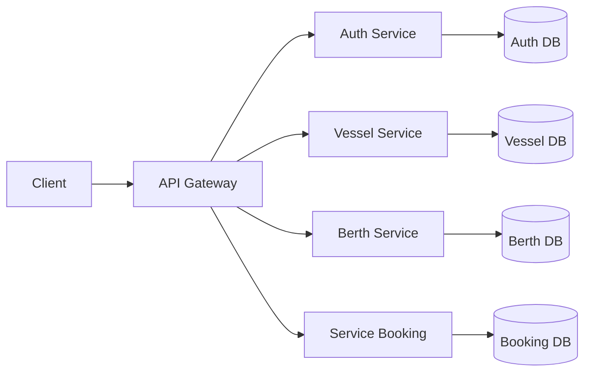
```mermaid
graph LR
    A[Client] --> B[API Gateway]
    B --> C[Auth Service]
    B --> D[Vessel Service]
    B --> E[Berth Service]
    B --> F[Service Booking]
    
    C --> G[(Auth DB)]
    D --> H[(Vessel DB)]
    E --> I[(Berth DB)]
    F --> J[(Booking DB)]
```

### 3.3.2 API Endpoint Specifications

| Endpoint | Method | Purpose | Request Format | Response Format |
| --- | --- | --- | --- | --- |
| /api/v1/vessel-calls | POST | Create vessel call | JSON | JSON |
| /api/v1/berths/{id}/allocations | GET | List berth allocations | Query Params | JSON Array |
| /api/v1/services/book | POST | Book port service | JSON | JSON |
| /api/v1/clearance/{id}/status | PUT | Update clearance status | JSON | JSON |

### 3.3.3 Authentication Flow

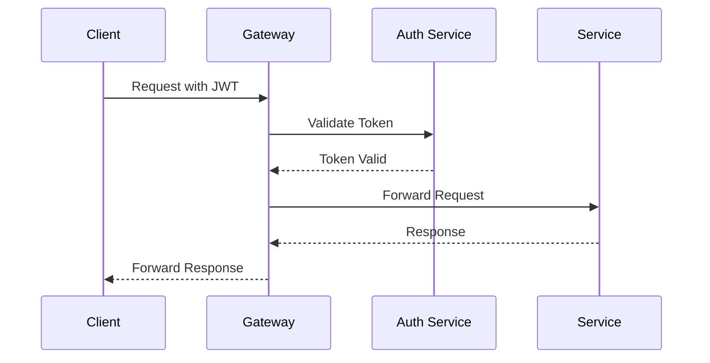
```mermaid
sequenceDiagram
    participant C as Client
    participant G as Gateway
    participant A as Auth Service
    participant S as Service
    
    C->>G: Request with JWT
    G->>A: Validate Token
    A-->>G: Token Valid
    G->>S: Forward Request
    S-->>G: Response
    G-->>C: Forward Response
```

### 3.3.4 API Security Controls

| Control | Implementation | Purpose |
| --- | --- | --- |
| Authentication | OAuth2/JWT | Identity verification |
| Authorization | RBAC | Access control |
| Rate Limiting | Token bucket | Prevent abuse |
| Input Validation | JSON Schema | Request validation |
| SSL/TLS | TLS 1.3 | Transport security |
| API Keys | UUID v4 | Client identification |

# 4. TECHNOLOGY STACK

## 4.1 PROGRAMMING LANGUAGES

| Platform/Component | Language | Version | Justification |
| --- | --- | --- | --- |
| Backend | Java | 17 LTS | - Enterprise-grade performance<br>- Strong typing and compile-time safety<br>- Extensive maritime industry libraries<br>- Alignment with existing port systems |
| Frontend | TypeScript | 4.9+ | - Type safety for large-scale Angular applications<br>- Enhanced developer productivity<br>- Better maintainability and refactoring |
| Database | PL/pgSQL | 14+ | - Native PostgreSQL procedural language<br>- Efficient stored procedures for complex port operations |
| Scripts | Python | 3.11+ | - Data processing and ETL scripts<br>- System maintenance automation<br>- Integration testing |

## 4.2 FRAMEWORKS & LIBRARIES

### 4.2.1 Core Frameworks

| Framework | Version | Purpose | Justification |
| --- | --- | --- | --- |
| Spring Boot | 3.1.x | Backend Framework | - Production-ready features<br>- Extensive middleware support<br>- Built-in security features |
| Spring Security | 6.1.x | Security Framework | - OAuth2/JWT integration<br>- RBAC support<br>- Industry standard security |
| Angular | 16.x | Frontend Framework | - Enterprise-ready framework<br>- Modular architecture<br>- Strong TypeScript integration |
| Spring Cloud | 2022.0.x | Distributed Systems | - Service discovery<br>- Configuration management<br>- Circuit breaking |

### 4.2.2 Supporting Libraries

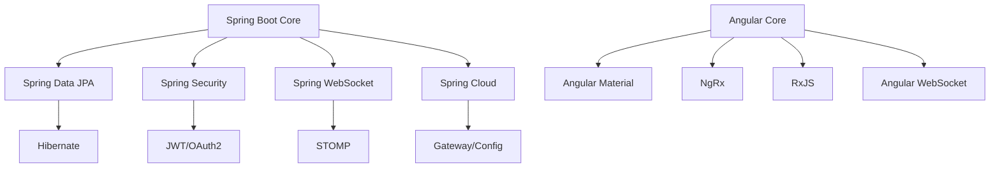
```mermaid
graph TD
    A[Spring Boot Core] --> B[Spring Data JPA]
    A --> C[Spring Security]
    A --> D[Spring WebSocket]
    A --> E[Spring Cloud]
    
    B --> F[Hibernate]
    C --> G[JWT/OAuth2]
    D --> H[STOMP]
    E --> I[Gateway/Config]
    
    J[Angular Core] --> K[Angular Material]
    J --> L[NgRx]
    J --> M[RxJS]
    J --> N[Angular WebSocket]
```

## 4.3 DATABASES & STORAGE

### 4.3.1 Primary Database

| Component | Technology | Version | Purpose |
| --- | --- | --- | --- |
| RDBMS | PostgreSQL | 14.x | Primary data store |
| Spatial Extension | PostGIS | 3.3.x | Geographical data handling |
| Connection Pool | HikariCP | 5.0.x | Connection management |
| Migration | Flyway | 9.x | Schema versioning |

### 4.3.2 Caching & Memory Storage

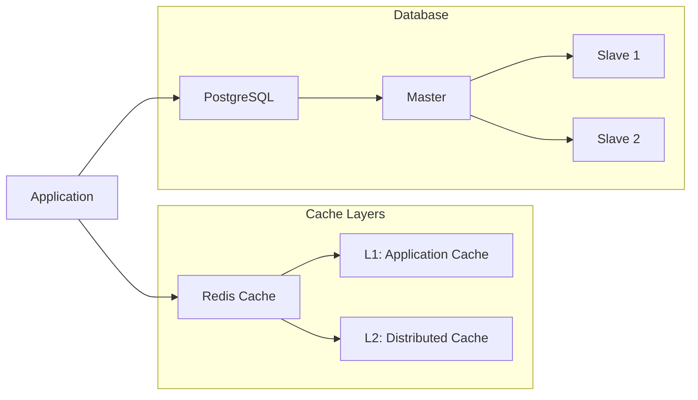
```mermaid
graph LR
    A[Application] --> B[Redis Cache]
    A --> C[PostgreSQL]
    
    subgraph Cache Layers
        B --> D[L1: Application Cache]
        B --> E[L2: Distributed Cache]
    end
    
    subgraph Database
        C --> F[Master]
        F --> G[Slave 1]
        F --> H[Slave 2]
    end
```

## 4.4 THIRD-PARTY SERVICES

| Service Category | Provider | Purpose | Integration Method |
| --- | --- | --- | --- |
| Weather API | OpenWeather | Maritime weather data | REST API |
| Email Service | SendGrid | Notifications | SMTP/API |
| SMS Gateway | Twilio | Urgent alerts | REST API |
| Maps | Mapbox | Vessel tracking | JavaScript SDK |
| Monitoring | Datadog | System monitoring | Agent/API |
| Log Management | ELK Stack | Log aggregation | Logstash/API |

## 4.5 DEVELOPMENT & DEPLOYMENT

### 4.5.1 Development Tools

| Category | Tool | Version | Purpose |
| --- | --- | --- | --- |
| IDE | IntelliJ IDEA | 2023.2+ | Java development |
| IDE | VS Code | Latest | Frontend development |
| API Testing | Postman | Latest | API development |
| Version Control | Git | 2.40+ | Source control |
| Documentation | Swagger | 3.0 | API documentation |

### 4.5.2 Deployment Pipeline

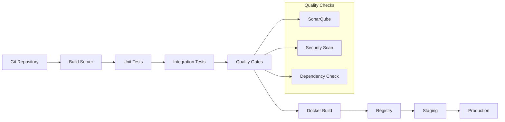
```mermaid
graph LR
    A[Git Repository] --> B[Build Server]
    B --> C[Unit Tests]
    C --> D[Integration Tests]
    D --> E[Quality Gates]
    E --> F[Docker Build]
    F --> G[Registry]
    G --> H[Staging]
    H --> I[Production]
    
    subgraph Quality Checks
        J[SonarQube]
        K[Security Scan]
        L[Dependency Check]
    end
    
    E --> J
    E --> K
    E --> L
```

### 4.5.3 Infrastructure Requirements

| Component | Specification | Scaling Strategy |
| --- | --- | --- |
| Application Servers | 8 cores, 32GB RAM | Horizontal auto-scaling |
| Database | 16 cores, 64GB RAM | Master-slave replication |
| Cache | 4 cores, 16GB RAM | Redis cluster |
| Load Balancer | Azure Load Balancer | Zone redundancy |
| Storage | Azure Managed Disks | Auto-scaling storage |

# 5. SYSTEM DESIGN

## 5.1 User Interface Design

### 5.1.1 Layout Structure

The Vessel Call Management system follows a responsive layout with a consistent navigation pattern:

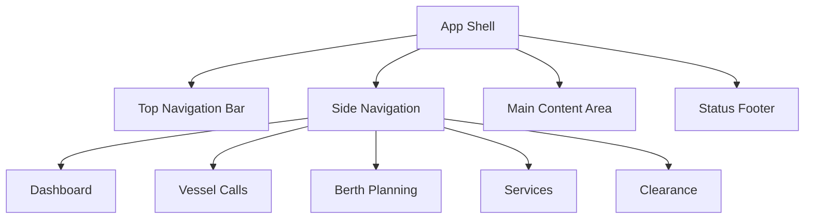
```mermaid
graph TD
    A[App Shell] --> B[Top Navigation Bar]
    A --> C[Side Navigation]
    A --> D[Main Content Area]
    A --> E[Status Footer]
    
    C --> F[Dashboard]
    C --> G[Vessel Calls]
    C --> H[Berth Planning]
    C --> I[Services]
    C --> J[Clearance]
```

### 5.1.2 Key Screen Layouts

#### Dashboard View

```
+------------------------------------------+
|[Logo] Search Bar         Alerts  Profile  |
+------------------------------------------+
|        |                                  |
| Nav    | Vessel Summary Cards             |
| Menu   | [Vessel 1] [Vessel 2] [Vessel 3]|
|        |                                  |
|        | Berth Utilization Chart         |
|        | [===========================]    |
|        |                                  |
|        | Pending Actions                  |
|        | - Clearance Approvals (3)       |
|        | - Service Requests (5)          |
+------------------------------------------+
```

#### Berth Planning Board

```
+------------------------------------------+
| Timeline Controls    Filter   Export      |
+------------------------------------------+
| Berth 1 |[====Vessel A====]|             |
|---------|------------------|-------------|
| Berth 2 |        |[==Vessel B==]|       |
|---------|------------------|-------------|
| Berth 3 |[=Vessel C=]|    |[=Vessel D=] |
+------------------------------------------+
```

## 5.2 Database Design

### 5.2.1 Entity Relationship Diagram

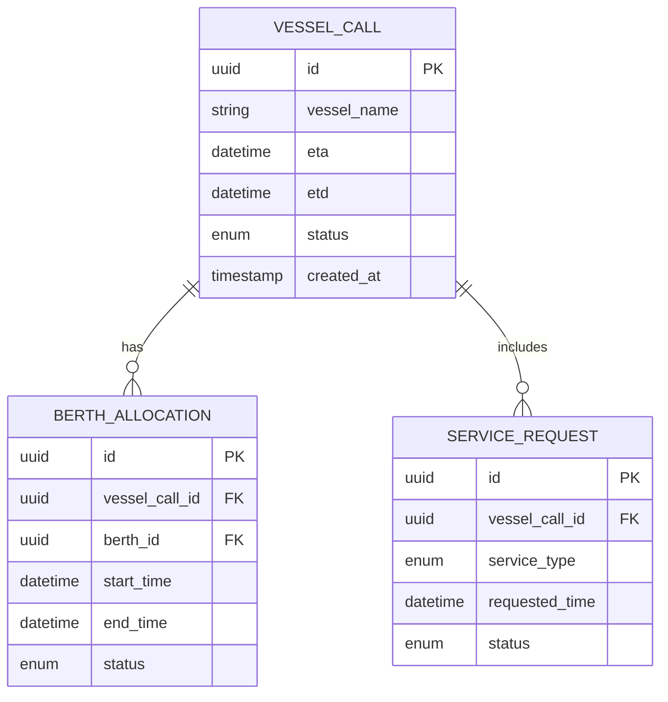
```mermaid
erDiagram
    VESSEL_CALL ||--o{ BERTH_ALLOCATION : has
    VESSEL_CALL ||--o{ SERVICE_REQUEST : includes
    VESSEL_CALL {
        uuid id PK
        string vessel_name
        datetime eta
        datetime etd
        enum status
        timestamp created_at
    }
    BERTH_ALLOCATION {
        uuid id PK
        uuid vessel_call_id FK
        uuid berth_id FK
        datetime start_time
        datetime end_time
        enum status
    }
    SERVICE_REQUEST {
        uuid id PK
        uuid vessel_call_id FK
        enum service_type
        datetime requested_time
        enum status
    }
```

### 5.2.2 Database Optimization

| Strategy | Implementation | Purpose |
| --- | --- | --- |
| Indexing | Composite indexes on frequently queried fields | Improve query performance |
| Partitioning | Date-based partitioning for historical data | Manage large datasets efficiently |
| Caching | Redis caching for frequently accessed data | Reduce database load |
| Replication | Master-slave replication setup | High availability |

## 5.3 API Design

### 5.3.1 REST API Endpoints

| Endpoint | Method | Purpose | Request/Response Format |
| --- | --- | --- | --- |
| /api/v1/vessel-calls | POST | Create new vessel call | JSON |
| /api/v1/berths/{id}/allocations | GET | List berth allocations | JSON Array |
| /api/v1/services/book | POST | Book port service | JSON |
| /api/v1/clearance/{id} | PUT | Update clearance status | JSON |

### 5.3.2 API Flow Diagram

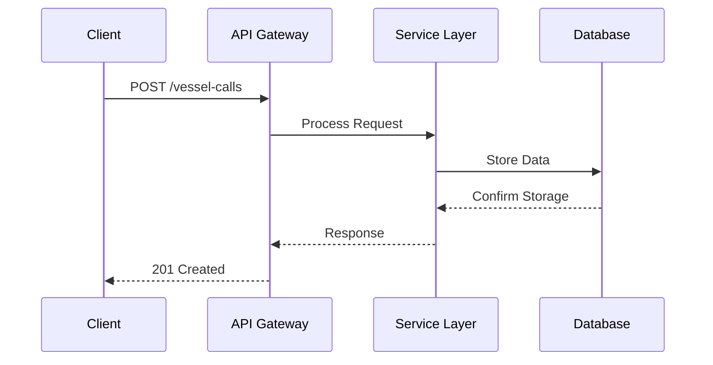
```mermaid
sequenceDiagram
    participant C as Client
    participant A as API Gateway
    participant S as Service Layer
    participant D as Database
    
    C->>A: POST /vessel-calls
    A->>S: Process Request
    S->>D: Store Data
    D-->>S: Confirm Storage
    S-->>A: Response
    A-->>C: 201 Created
```

### 5.3.3 WebSocket Events

| Event Type | Direction | Payload Format | Purpose |
| --- | --- | --- | --- |
| VESSEL_UPDATE | Server→Client | JSON | Real-time vessel status updates |
| BERTH_CHANGE | Server→Client | JSON | Berth allocation changes |
| SERVICE_STATUS | Server→Client | JSON | Service booking updates |
| CLEARANCE_UPDATE | Server→Client | JSON | Clearance status changes |

## 5.4 Integration Architecture

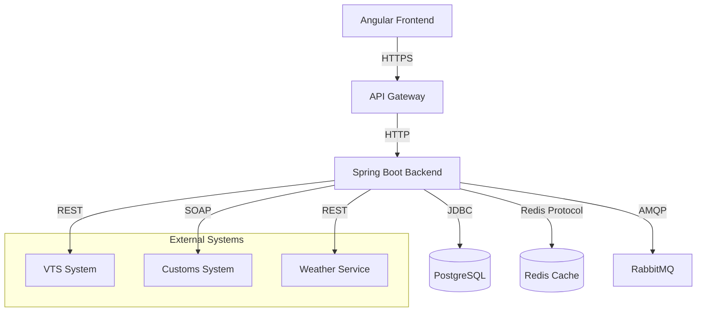
```mermaid
graph TD
    A[Angular Frontend] -->|HTTPS| B[API Gateway]
    B -->|HTTP| C[Spring Boot Backend]
    C -->|JDBC| D[(PostgreSQL)]
    C -->|Redis Protocol| E[(Redis Cache)]
    C -->|AMQP| F[RabbitMQ]
    
    subgraph External Systems
        G[VTS System]
        H[Customs System]
        I[Weather Service]
    end
    
    C -->|REST| G
    C -->|SOAP| H
    C -->|REST| I
```

## 5.5 Security Architecture

| Layer | Security Control | Implementation |
| --- | --- | --- |
| Transport | TLS 1.3 | Spring Security |
| Authentication | OAuth2/JWT | Spring Security OAuth |
| Authorization | RBAC | Custom implementation |
| Data | Column-level encryption | AES-256 |
| API | Rate limiting | Spring Cloud Gateway |

## 5.6 Monitoring Architecture

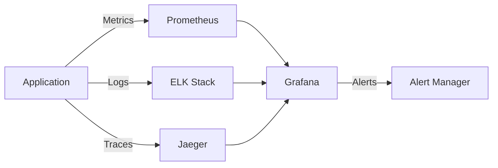
```mermaid
graph LR
    A[Application] -->|Metrics| B[Prometheus]
    A -->|Logs| C[ELK Stack]
    A -->|Traces| D[Jaeger]
    
    B --> E[Grafana]
    C --> E
    D --> E
    
    E -->|Alerts| F[Alert Manager]
```

# 6. USER INTERFACE DESIGN

## 6.1 Design System

### 6.1.1 UI Component Legend

```
Icons:
[?] - Help/Information tooltip
[$] - Financial/Payment related
[i] - Information display
[+] - Add new/Create action
[x] - Close/Delete/Remove
[<] [>] - Navigation/Pagination
[^] - Upload functionality
[#] - Dashboard/Menu
[@] - User profile/Account
[!] - Warning/Alert
[=] - Settings/Menu toggle
[*] - Favorite/Important

Input Elements:
[ ] - Checkbox
( ) - Radio button
[...] - Text input field
[v] - Dropdown select
[Button] - Action button
[====] - Progress indicator

Layout Elements:
+--+ - Container border
|  | - Vertical separator
+-- - Hierarchical relationship
```

## 6.2 Core Screens

### 6.2.1 Main Dashboard

```
+----------------------------------------------------------+
|[=] Port VMS                [@] Admin  [?] Help  [x] Logout|
+----------------------------------------------------------+
|                                                           |
| [#] Dashboard Overview                     [!] Alerts (3) |
|                                                           |
| Active Vessel Calls (12)     Berth Utilization           |
| +------------------------+   +------------------------+    |
| | Vessel   Status  Berth |   | [=========>] 85%      |   |
| |------------------------+   +------------------------+    |
| | Maersk L  AT_BERTH  12 |                              |
| | MSC Pearl ARRIVING   -- |   Expected Arrivals Today    |
| | CMA Vec   DEPARTING  08 |   +----------------------+   |
| +------------------------+   | 08:00 - Nordic Star    |   |
|                             | 13:15 - Pacific Glory  |   |
| [<] 1 2 3 [>]              | 17:45 - Asian Express  |   |
|                             +----------------------+    |
+----------------------------------------------------------+
```

### 6.2.2 Berth Planning Board

```
+----------------------------------------------------------+
| Berth Planning                        [+] New Allocation   |
+----------------------------------------------------------+
| Date: [...11/15/2023...] [Apply]                          |
|                                                           |
| Timeline:  00  02  04  06  08  10  12  14  16  18  20  22|
| Berth 01: |====Maersk Liner====|     |==Pacific Glory==| |
| Berth 02: |==Nordic==|    |==Asian Express==|           | |
| Berth 03: |     |========CMA Vector========|            | |
| Berth 04: |====================MSC Pearl===============| | |
|                                                           |
| Legend:                                                   |
| [====] Occupied  [----] Reserved  [    ] Available       |
+----------------------------------------------------------+
```

### 6.2.3 Pre-Arrival Form

```
+----------------------------------------------------------+
| Pre-Arrival Notification                [?] Form Guide     |
+----------------------------------------------------------+
| Vessel Details:                                           |
| IMO Number:    [...............] [Verify]                 |
| Vessel Name:   [...............]                          |
| Call Sign:     [...............]                          |
|                                                           |
| Schedule:                                                 |
| ETA: [...DD/MM/YYYY...] [...HH:MM...]                    |
| ETD: [...DD/MM/YYYY...] [...HH:MM...]                    |
|                                                           |
| Cargo Information:                                        |
| Type:          [v Bulk Carrier    v]                      |
| Hazardous:     ( ) Yes  (*) No                           |
|                                                           |
| Documents:                                                |
| [ ] Crew List          [^ Upload]                        |
| [ ] Cargo Manifest     [^ Upload]                        |
| [ ] Safety Declaration [^ Upload]                        |
|                                                           |
| [    Cancel    ]                     [    Submit    ]     |
+----------------------------------------------------------+
```

### 6.2.4 Service Booking Interface

```
+----------------------------------------------------------+
| Port Services Booking                    [$] Service Rates |
+----------------------------------------------------------+
| Vessel: MSC Pearl                       Call#: VMS-2023-12|
|                                                           |
| Select Services:                                          |
| [x] Pilotage                                             |
|     Date: [...15/11/2023...]  Time: [...08:00...]        |
|                                                           |
| [x] Tugboat                                              |
|     Quantity: [v 2 v]                                    |
|     Date: [...15/11/2023...]  Time: [...08:00...]        |
|                                                           |
| [ ] Mooring                                              |
|     Team Size: [v Select v]                              |
|     Date: [...............]  Time: [..........]          |
|                                                           |
| Total Estimated Cost: $2,450                             |
|                                                           |
| [    Back    ]                     [    Book Now    ]     |
+----------------------------------------------------------+
```

### 6.2.5 Clearance Workflow

```
+----------------------------------------------------------+
| Vessel Clearance Status              [!] 2 Items Pending  |
+----------------------------------------------------------+
| Vessel: Nordic Star                  IMO: 9876543         |
|                                                           |
| Required Clearances:                                      |
| [x] Customs Declaration                                   |
|     Status: Approved                 15/11/2023 09:15     |
|                                                           |
| [ ] Immigration                                          |
|     Status: Pending                  [Review Documents]   |
|                                                           |
| [ ] Port Authority                                       |
|     Status: Awaiting Immigration     [Locked]            |
|                                                           |
| Progress: [===========>   ] 65%                          |
|                                                           |
| [    Refresh    ]                   [    Complete    ]    |
+----------------------------------------------------------+
```

## 6.3 Responsive Design Breakpoints

| Breakpoint | Width | Layout Adjustments |
| --- | --- | --- |
| Mobile | \< 768px | Single column, collapsible menus |
| Tablet | 768px - 1024px | Two-column layout, condensed navigation |
| Desktop | 1024px - 1440px | Full layout with all features |
| Large Display | \> 1440px | Enhanced data visualization |

## 6.4 Accessibility Requirements

- WCAG 2.1 Level AA compliance
- Keyboard navigation support
- Screen reader compatibility
- Minimum contrast ratio 4.5:1
- Focus indicators for all interactive elements
- Alternative text for all images and icons
- Resizable text support up to 200%

# 7. SECURITY CONSIDERATIONS

## 7.1 Authentication and Authorization

### 7.1.1 Authentication Strategy

| Method | Implementation | Purpose |
| --- | --- | --- |
| OAuth2/JWT | Spring Security OAuth2 | Primary authentication mechanism |
| 2FA | Google Authenticator | Additional security for admin access |
| API Keys | UUID v4 | External system integration |
| SSO | Azure AD Integration | Enterprise user authentication |

### 7.1.2 Role-Based Access Control (RBAC)

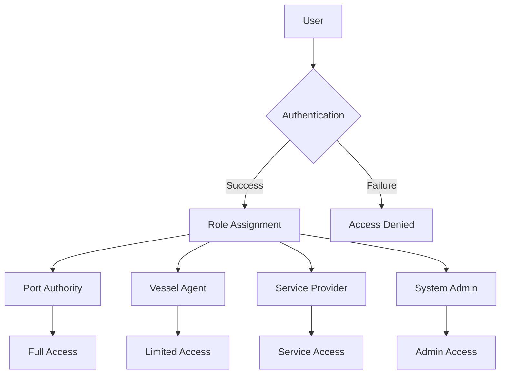
```mermaid
graph TD
    A[User] --> B{Authentication}
    B -->|Success| C[Role Assignment]
    B -->|Failure| D[Access Denied]
    
    C --> E[Port Authority]
    C --> F[Vessel Agent]
    C --> G[Service Provider]
    C --> H[System Admin]
    
    E --> I[Full Access]
    F --> J[Limited Access]
    G --> K[Service Access]
    H --> L[Admin Access]
```

### 7.1.3 Permission Matrix

| Role | Vessel Calls | Berth Management | Services | Admin Functions |
| --- | --- | --- | --- | --- |
| Port Authority | Create, Read, Update, Delete | Full Access | Approve | View Only |
| Vessel Agent | Create, Read | View Only | Request | None |
| Service Provider | Read | View Only | Manage Own | None |
| System Admin | Full Access | Full Access | Full Access | Full Access |

## 7.2 Data Security

### 7.2.1 Encryption Strategy

| Layer | Method | Implementation |
| --- | --- | --- |
| Transport | TLS 1.3 | Spring Security |
| Database | Column-level | AES-256 |
| File Storage | Encryption at Rest | Azure Storage Encryption |
| Backup | Encrypted Backups | pgcrypto |

### 7.2.2 Sensitive Data Handling

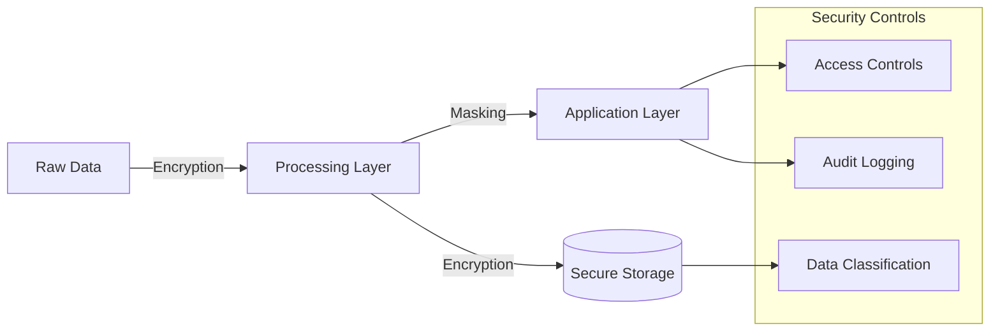
```mermaid
flowchart LR
    A[Raw Data] -->|Encryption| B[Processing Layer]
    B -->|Masking| C[Application Layer]
    B -->|Encryption| D[(Secure Storage)]
    
    subgraph Security Controls
        E[Access Controls]
        F[Audit Logging]
        G[Data Classification]
    end
    
    C --> E
    C --> F
    D --> G
```

### 7.2.3 Data Classification

| Classification | Examples | Security Measures |
| --- | --- | --- |
| Public | Vessel schedules, Port information | Basic encryption |
| Confidential | Cargo details, Service bookings | Column-level encryption |
| Restricted | Personal data, Financial information | Encryption + Access controls |
| Critical | Security clearances, System credentials | Maximum security measures |

## 7.3 Security Protocols

### 7.3.1 Network Security

```mermaid
graph TD
    A[Internet] -->|WAF| B[DMZ]
    B -->|Firewall| C[Application Layer]
    C -->|Firewall| D[Database Layer]
    
    subgraph DMZ
        E[Load Balancer]
        F[API Gateway]
    end
    
    subgraph Application Layer
        G[App Servers]
        H[Cache Servers]
    end
    
    subgraph Database Layer
        I[Primary DB]
        J[Replica DB]
    end
```

### 7.3.2 Security Monitoring

| Component | Tool | Purpose |
| --- | --- | --- |
| SIEM | ELK Stack | Log aggregation and analysis |
| IDS/IPS | Snort | Network intrusion detection |
| Vulnerability Scanner | SonarQube | Code security scanning |
| Security Monitoring | Azure Security Center | Cloud security monitoring |

### 7.3.3 Security Compliance

| Standard | Requirements | Implementation |
| --- | --- | --- |
| GDPR | Data protection | Data encryption, Access controls |
| ISPS Code | Port security | Security protocols, Access management |
| ISO 27001 | Information security | Security management system |
| Local Port Authority | Regional compliance | Custom security measures |

### 7.3.4 Security Incident Response

```mermaid
stateDiagram-v2
    [*] --> Detection
    Detection --> Analysis
    Analysis --> Containment
    Containment --> Eradication
    Eradication --> Recovery
    Recovery --> PostIncident
    PostIncident --> [*]
    
    Analysis --> Escalation: Major Incident
    Escalation --> Containment
```

### 7.3.5 Security Update Management

| Component | Update Frequency | Process |
| --- | --- | --- |
| OS Patches | Monthly | Automated deployment |
| Security Patches | As available | Emergency deployment |
| Dependencies | Weekly | Automated scanning |
| SSL Certificates | 90 days | Automated renewal |

# 8. INFRASTRUCTURE

## 8.1 DEPLOYMENT ENVIRONMENT

The Vessel Call Management system will utilize a hybrid cloud deployment model with primary infrastructure in Azure and disaster recovery capabilities on-premises.

| Environment | Purpose | Infrastructure |
| --- | --- | --- |
| Development | Development and testing | Azure Dev/Test Labs |
| Staging | UAT and pre-production testing | Azure App Service |
| Production | Live system operation | Azure Kubernetes Service |
| DR Site | Disaster recovery | On-premises datacenter |

```mermaid
flowchart TD
    subgraph Azure Cloud
        A[Azure Front Door] --> B[Azure App Gateway]
        B --> C[AKS Cluster]
        C --> D[(Azure Database for PostgreSQL)]
        C --> E[(Azure Cache for Redis)]
        C --> F[Azure Storage]
    end
    
    subgraph On-Premises DR
        G[Load Balancer] --> H[Application Servers]
        H --> I[(PostgreSQL Replica)]
        H --> J[(Redis Replica)]
        H --> K[Storage]
    end
    
    A -.-> G
    D -.-> I
    E -.-> J
    F -.-> K
```

## 8.2 CLOUD SERVICES

| Service | Purpose | Justification |
| --- | --- | --- |
| Azure Kubernetes Service | Container orchestration | Managed Kubernetes with integrated tooling |
| Azure Database for PostgreSQL | Primary database | Managed PostgreSQL with automatic scaling |
| Azure Cache for Redis | Distributed caching | High-performance caching with replication |
| Azure Monitor | Monitoring and alerting | Integrated monitoring for all Azure services |
| Azure Key Vault | Secret management | Centralized secret and certificate management |
| Azure Front Door | Global load balancing | Global distribution with WAF capabilities |

## 8.3 CONTAINERIZATION

Docker containers will be used for application deployment with the following structure:

```mermaid
graph TD
    subgraph Container Images
        A[Base Image: adoptopenjdk:17-jre]
        B[Base Image: nginx:alpine]
        
        A --> C[Backend Image]
        B --> D[Frontend Image]
        
        C --> E[Application Container]
        D --> F[Web Container]
    end
    
    subgraph Supporting Services
        G[Redis Container]
        H[Elasticsearch Container]
        I[Logstash Container]
        J[Kibana Container]
    end
```

| Container | Base Image | Purpose |
| --- | --- | --- |
| Backend | adoptopenjdk:17-jre | Spring Boot application |
| Frontend | nginx:alpine | Angular application |
| Redis | redis:6-alpine | Caching service |
| ELK Stack | elastic/elasticsearch:7.17.0 | Logging and monitoring |

## 8.4 ORCHESTRATION

Kubernetes will be used for container orchestration with the following configuration:

```mermaid
graph TD
    subgraph AKS Cluster
        A[Ingress Controller] --> B[Frontend Pods]
        A --> C[Backend Pods]
        
        B --> D[Frontend Service]
        C --> E[Backend Service]
        
        E --> F[(Persistent Storage)]
        E --> G[Redis StatefulSet]
        
        H[Horizontal Pod Autoscaler] --> B
        H --> C
    end
```

| Component | Configuration | Purpose |
| --- | --- | --- |
| Node Pools | 3 nodes (D4s v3) | Application workload hosting |
| Autoscaling | 2-10 pods | Automatic scaling based on CPU/memory |
| Storage Classes | Premium SSD | High-performance storage |
| Network Policy | Calico | Network security and isolation |

## 8.5 CI/CD PIPELINE

```mermaid
graph LR
    A[Git Repository] --> B[Azure DevOps]
    B --> C[Build]
    C --> D[Unit Tests]
    D --> E[Security Scan]
    E --> F[Container Build]
    F --> G[Container Registry]
    G --> H[Deploy to Dev]
    H --> I[Integration Tests]
    I --> J[Deploy to Staging]
    J --> K[UAT]
    K --> L[Deploy to Prod]
```

| Stage | Tools | Purpose |
| --- | --- | --- |
| Source Control | Azure DevOps Repos | Code version control |
| Build | Azure Pipelines | Automated build process |
| Testing | JUnit, Selenium | Automated testing |
| Security | SonarQube, OWASP | Security scanning |
| Artifact Storage | Azure Container Registry | Container image storage |
| Deployment | Azure Pipelines, Helm | Automated deployment |

### Deployment Configuration

```yaml
# Example Helm values.yaml
replicaCount: 3
image:
  repository: acrregistry.azurecr.io/vcms
  tag: latest
  
resources:
  requests:
    cpu: 500m
    memory: 1Gi
  limits:
    cpu: 2000m
    memory: 4Gi

autoscaling:
  enabled: true
  minReplicas: 2
  maxReplicas: 10
  targetCPUUtilizationPercentage: 80
```

# 8. APPENDICES

## 8.1 Additional Technical Information

### 8.1.1 Database Partitioning Strategy

```mermaid
graph TD
    A[Vessel Call Data] --> B[Current Year]
    A --> C[Historical Data]
    
    B --> D[Monthly Partitions]
    C --> E[Yearly Partitions]
    
    D --> F[Active Data]
    D --> G[Recent History]
    
    E --> H[Archive Storage]
    E --> I[Cold Storage]
```

### 8.1.2 Backup Rotation Schedule

| Backup Type | Retention | Storage Location | Encryption |
| --- | --- | --- | --- |
| Daily Incremental | 7 days | Primary Storage | AES-256 |
| Weekly Full | 4 weeks | Secondary Storage | AES-256 |
| Monthly Archive | 12 months | Cold Storage | AES-256 |
| Yearly Archive | 7 years | Offsite Storage | AES-256 |

### 8.1.3 System Health Monitoring Thresholds

| Metric | Warning Threshold | Critical Threshold | Action |
| --- | --- | --- | --- |
| CPU Usage | 70% | 85% | Auto-scale |
| Memory Usage | 75% | 90% | Alert + Scale |
| Disk Space | 75% | 90% | Alert |
| Response Time | 2s | 5s | Alert |
| Error Rate | 1% | 5% | Alert + Page |

## 8.2 GLOSSARY

| Term | Definition |
| --- | --- |
| Berth Window | Scheduled time slot allocated for vessel berthing |
| Cargo Manifest | Detailed list of cargo carried by a vessel |
| Draft Survey | Measurement of vessel's displacement to determine cargo weight |
| Hot Storage | Frequently accessed data stored on high-performance media |
| Load Line | Maximum draft mark to which a vessel may be safely loaded |
| Mooring Operation | Process of securing a vessel to a berth |
| Port State Control | Inspection of foreign ships in national ports |
| Quay | Structure built parallel to waterway for vessel berthing |
| Stevedoring | Loading and unloading of vessel cargo |
| Vessel Draft | Vertical distance between waterline and keel |

## 8.3 ACRONYMS

| Acronym | Full Form |
| --- | --- |
| AES | Advanced Encryption Standard |
| ATA | Actual Time of Arrival |
| ATD | Actual Time of Departure |
| CDN | Content Delivery Network |
| CRUD | Create, Read, Update, Delete |
| DDoS | Distributed Denial of Service |
| ETA | Estimated Time of Arrival |
| ETD | Estimated Time of Departure |
| IMDG | International Maritime Dangerous Goods |
| JPA | Java Persistence API |
| JWT | JSON Web Token |
| MTBF | Mean Time Between Failures |
| MTTR | Mean Time To Repair |
| OAuth | Open Authorization |
| PCS | Port Community System |
| RBAC | Role-Based Access Control |
| REST | Representational State Transfer |
| SSL | Secure Sockets Layer |
| TLS | Transport Layer Security |
| VTS | Vessel Traffic Service |
| WAF | Web Application Firewall |
| XSS | Cross-Site Scripting |